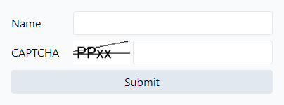
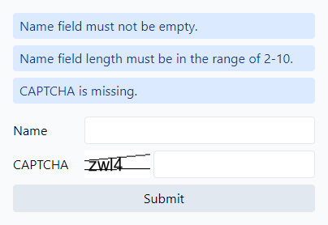
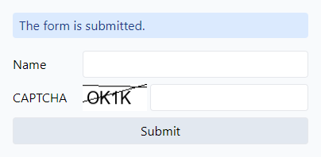

## CAPTCHA (image)

Simple CAPTCHA  implementation in PHP.

## About
This is an experiment.

- [x] simple UI/form
- [x] captcha image generation
  - [ ] live refresh
  - [ ] more image modifications: rotation, translation, noise, distortion, ...
- [x] functional/submittable form
- [x] form validation, error notifications
- [x] captcha check on submit
- [ ] ...

## Screenshots

